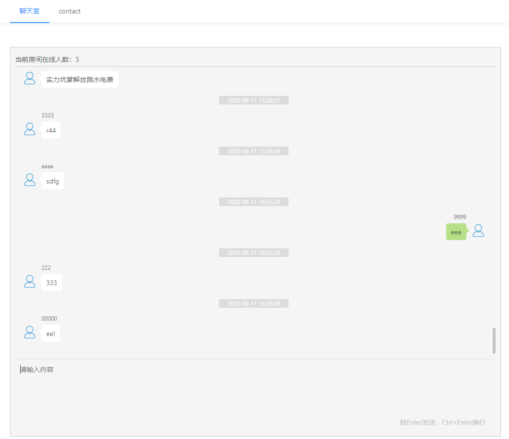

# 聊天室

基于nuxt,Vue,Golang

## Build Setup

```bash
# install dependencies
$ npm install

# serve with hot reload at localhost:3000
$ npm run dev

# build for production and launch server
$ npm run build
$ npm run start

# generate static project
$ npm run generate
```
## 文件目录
```
├── README.md
├── app.html     #模板
├── assets       #静态文件
│   ├── README.md
│   ├── avatar.png
│   └── example.png
├── components
│   ├── Logo.vue
│   └── README.md
├── jest.config.js
├── layouts      #布局，可以放公共部分，比如navbar
│   ├── README.md
│   └── default.vue
├── middleware
│   └── README.md
├── nuxt.config.js
├── package-lock.json
├── package.json
├── pages        #页面文件，在此目录的vue会生成对应路由
│   ├── README.md
│   ├── contact.vue
│   └── index.vue
├── plugins        #插件
│   ├── README.md
│   ├── antd-ui.js  #antd-ui
│   ├── sensitive-word-detection.js #敏感词检测
│   └── socket-io.js #socket-io
├── static
│   ├── README.md
│   └── favicon.ico
├── store
│   └── README.md
└── test
    └── Logo.spec.js
```

## socket server

[gf-admin-api](https://github.com/jangworn/gf-admin-api)

## example
This is an [example link](http://johnyn.com:8080/chat-room/).  

在不同的多个浏览器窗口打开即可测试多人聊天



