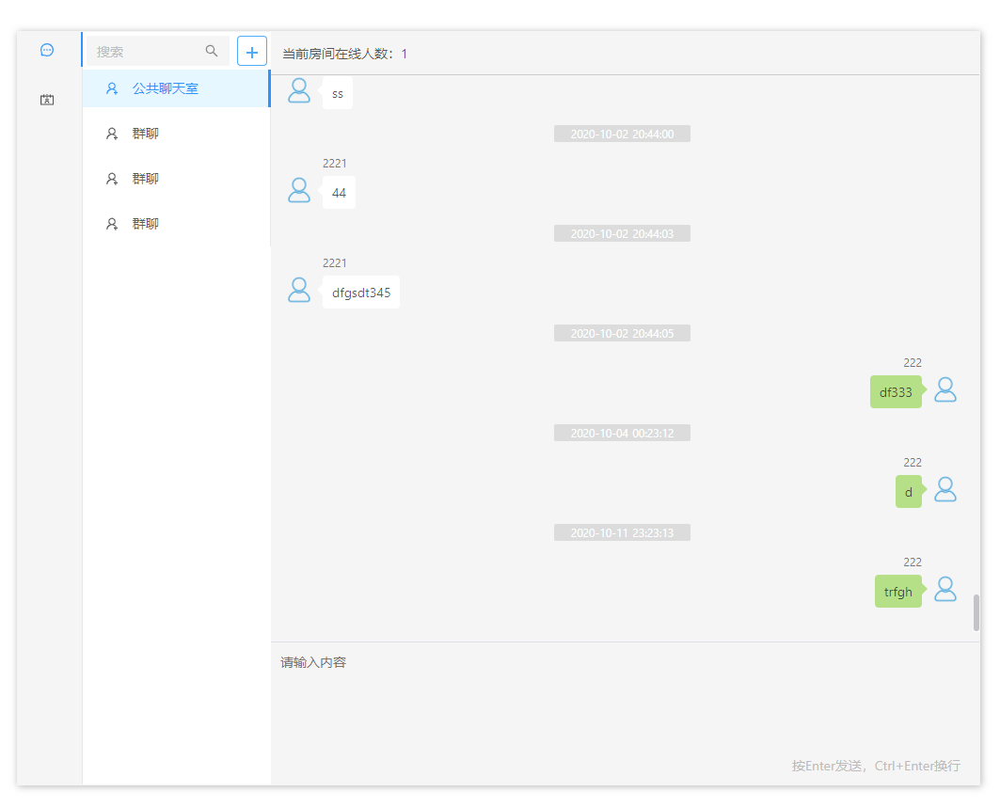

# 聊天室

基于nuxt,Vue,Golang

## Build Setup

```bash
# install dependencies
$ npm install

# serve with hot reload at localhost:3000
$ npm run dev

# build for production and launch server
$ npm run build
$ npm run start

# generate static project
$ npm run generate
```

## socket server

[gf-admin-api](https://github.com/jangworn/gf-admin-api)

## example
This is an [example link](https://johnyn.com/chat-room/).  

在不同的多个浏览器窗口打开即可测试多人聊天



